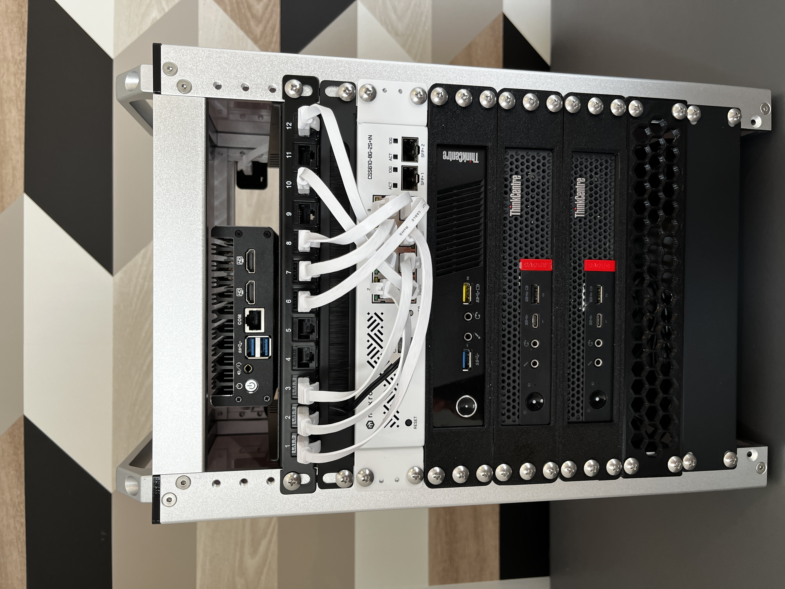
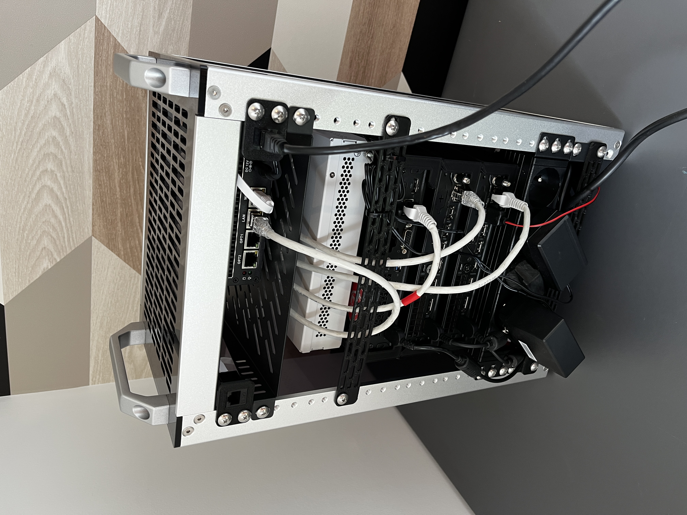

## Rack & White

This setup has been on my mind for a while — finally brought it to life.

### Build details

- [Protectli FW4B](https://amzn.eu/d/2zSOyJc)
- [Mikrotik CSS610-8G-2S+in](https://amzn.eu/d/8RDjH5p)
- 3x Lenovo Tiny (M720Q & 2xM75Q) from Ebay
- [PDU 4x type E](https://amzn.eu/d/aap8DOp)

My 2-Bay Synology will go on top, plugged in the left rear spot.\
Both of the 0.5U panels are from Desk Pi official store.\
I put a 120mm 5V usb fan underneath, not sure of the efficiency.

### 3D plans

I 3D printed Lenovo's rack mount from [this](https://www.printables.com/model/1040412-lenovo-thinkcentre-tiny-m720qm715qm920q-10-rack-mo) plan, they are just fine.
Bottom venting panel is from [this](https://www.printables.com/model/1149718-grid-rack-panel-1u-ventilation-panel-cover-for-10) plan.
Both of the rear blank panels are from [this](https://www.printables.com/model/1014591-10-inch-12u-rack-mount-blanks) plan.

### What's running

OPNsense gets its WAN IP via DHCP and handles LAN routing. I’ve added Tailscale to access the whole network remotely.
Right now the Proxmox cluster (16 CPUs, 64GB ram, 1To nvme) is only running some CTFs challenges, AD, some services (RSS agreg, torrenting, ...) and ofc dummy ct/vms

### Future plans

My next move will be to add a 4th node to the cluster, with way more compute power, when I will need it. I might be able to fit it next to the Protectli actually.\
Later plans are to build a second mini-rack with builtin NAS & Mini ITX at least, the rear RJ45 is already waiting for the extension.

### Ressources

- https://github.com/geerlingguy/mini-rack
